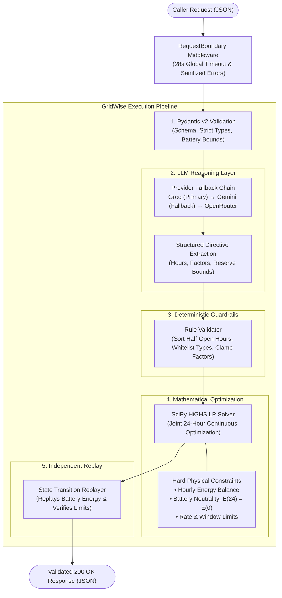

# GridWise API

[](https://github.com/Jahidul183019/BUP_Hackathon_Preli_DU_AlgoArchitects/actions/workflows/ci.yml)

**Live API**: https://bup-hackathon-preli-du-algoarchitects.onrender.com

## Submission Deliverables

| Deliverable | Location / Value |
|---|---|
| **1. Live API Endpoint** | https://bup-hackathon-preli-du-algoarchitects.onrender.com |
| **2. GitHub Repository** | https://github.com/Jahidul183019/BUP_Hackathon_Preli_DU_AlgoArchitects |
| **3. Docker Image Fallback** | `ghcr.io/jahidul183019/gridwise:latest` (`docker pull ghcr.io/jahidul183019/gridwise:latest`) |
| **4. Documentation & Setup** | This `README.md` (reproducible local setup & test guides) |
| **5. Demo Video (≤3:00 min)** | `[INSERT_DEMO_VIDEO_LINK_HERE]` (Accessible publicly without login) |

Python 3.12 + FastAPI. `POST /optimize-energy` runs the real pipeline:
LLM interpretation -> deterministic guardrails -> joint 24-hour LP optimization
-> independent final replay -> schema-validated JSON response.
The interpreter and optimizer also remain directly callable for isolated tests.

## Architecture Overview




## Run locally

From this directory:

```sh
python3 -m venv .venv
source .venv/bin/activate
pip install -r requirements.txt
uvicorn app.main:app --host 0.0.0.0 --port 8000 --no-access-log
```

Before starting, run `python3 -m examples.configure_keys` in your local terminal.
It prompts for Groq and Gemini keys with hidden input and saves a git-ignored `.env`
with owner-only permissions. The API loads this file automatically; environment
variables take precedence. `/health` needs no credentials; optimization needs at
least one configured provider. No OpenAI account or key is required.
Service port: **8000**. Interactive API documentation: http://localhost:8000/docs.

## Call the endpoints

```sh
curl -i http://localhost:8000/health
curl -i -X POST http://localhost:8000/optimize-energy \
  -H 'Content-Type: application/json' \
  --data-binary @examples/request.json
```

Both return HTTP 200 for valid requests. `/health` returns `{"status":"ok"}`.
The optimization response echoes `scenario_id`, returns one interpretation per note
and a valid 24-hour schedule, with totals computed from that schedule.
Malformed JSON, missing fields, invalid types, non-finite/negative energy values,
blank notes, duplicate/missing hours, and inconsistent battery bounds return HTTP 400.
Notes must contain 1–3 non-empty strings; hours must include 0–23 exactly once.

## Docker

```sh
docker build -t gridwise:local .
docker run --rm -p 8000:8000 --env-file .env gridwise:local
```

The container listens on `0.0.0.0:8000`.

### Docker fallback image (submission)

A tested container image is published to GitHub Container Registry on every
`main` push by the CI pipeline. Pull and run the fallback image:

```sh
docker pull ghcr.io/jahidul183019/gridwise:latest
docker run --rm -p 8000:8000 \
  -e GROQ_API_KEY="<your-key>" \
  -e GEMINI_API_KEY="<your-key>" \
  ghcr.io/jahidul183019/gridwise:latest
```

- **Registry**: `ghcr.io/jahidul183019/gridwise`
- **Tag**: `latest` (also available as `aff6963` for the current build)
- **Port**: `8000` (exposed, bound to `0.0.0.0`)
- **Secrets**: not baked in; pass via `-e` or `--env-file .env`
- **Health check**: `curl http://localhost:8000/health` → `{"status":"ok"}`

The image contains only `requirements.txt` and the `app/` package. No `.env`,
tests, examples, or documentation are included.

## Deployed API

The API is deployed on [Render](https://render.com) at:

```
https://bup-hackathon-preli-du-algoarchitects.onrender.com
```

Test the live deployment:

```sh
curl -i https://bup-hackathon-preli-du-algoarchitects.onrender.com/health
curl -i -X POST https://bup-hackathon-preli-du-algoarchitects.onrender.com/optimize-energy \
  -H 'Content-Type: application/json' \
  --data-binary @examples/request.json
```

Interactive API documentation: https://bup-hackathon-preli-du-algoarchitects.onrender.com/docs

Run the full 10-case live verification against the deployment:

```sh
python3 -m examples.check_live_api --base-url https://bup-hackathon-preli-du-algoarchitects.onrender.com --rounds 2
```

Render deploys automatically from the `main` branch. Credentials are configured
through Render environment variables, never committed.

## CI/CD (GitHub Actions)

Every push to `main` and every pull request triggers the CI pipeline
(`.github/workflows/ci.yml`):

1. **Test**: installs dependencies and runs the full offline test suite.
2. **Docker**: builds the image, starts a container, verifies `/health` returns
   `{"status":"ok"}` and malformed input returns HTTP 400.
3. **Publish**: on `main` pushes, tags and pushes the image to
   `ghcr.io/jahidul183019/gridwise:latest` and `ghcr.io/jahidul183019/gridwise:<sha>`.
4. **Deploy**: optionally triggers a Render deploy hook (set `RENDER_DEPLOY_HOOK`
   as a repository variable if using hook-based deploys).

## Extension points

- `app/schemas.py`: request and response models for all six directive types.
- `app/llm_interpreter.py`: LLM extraction, guardrails, and internal fallback markers.
- `app/schedule_optimizer.py`: joint LP scheduling.
- `app/final_validator.py`: independent replay validation.
- `app/main.py`: pipeline orchestration, deadlines and sanitized errors.
- The original `app/interpreter.py` and `app/optimizer.py` are unused legacy placeholders.

Dependencies: FastAPI, Pydantic, Uvicorn, SciPy; HTTPX for API tests. Never commit secrets; `.gitignore`
excludes common secret files and the Docker build copies only application code
and requirements.


## LLM interpreter (also callable independently)

```python
from app.llm_interpreter import interpret_notes, validate_directives

notes = [
    "Solar output will drop to about 20% from 1 PM to 3 PM.",
    "Keep the battery at least half full between 6 PM and 9 PM.",
    "The cafeteria menu changes tomorrow.",
]
directives = interpret_notes(notes, capacity_kwh=200)
# interpret_notes already runs validation; this is also callable independently:
checked = validate_directives(directives, note_count=len(notes), capacity_kwh=200)
```

Capacity is required to convert relative reserves and reject reserves above capacity.
The validator requires the original note count so missing trailing notes cannot be
mistaken for a complete result. One invalid entry does not invalidate other notes.
Unsorted/duplicate/out-of-range hours are rejected; entries themselves are returned
in note-index order. Duplicate note mappings fall back rather than choosing one.

The default provider order is Groq, then Gemini, then OpenRouter (skipped if its key is unset). Defaults are
`GROQ_MODEL=openai/gpt-oss-20b`, `GEMINI_MODEL=gemini-3.1-flash-lite`, and `OPENROUTER_MODEL=openai/gpt-4o-mini`.
Set `GROQ_API_KEY`, `GEMINI_API_KEY`, and optionally `OPENROUTER_API_KEY` in the private `.env` or environment.
Models are configurable. `LLM_PROVIDER_ORDER=gemini` or `groq` isolates one
provider for live testing; `groq,gemini` or `groq,gemini,openrouter` enables fallback.

The adapter uses [Groq's documented endpoint](https://console.groq.com/docs/openai)
and [Gemini's compatible endpoint](https://ai.google.dev/gemini-api/docs/openai).
These are direct requests to those providers, not requests to OpenAI.
HTTPX makes cancellable asynchronous requests inside the pipeline worker.
Non-final providers get one quick retry on HTTP 429/5xx (0.5 s backoff), an 8-second wall-clock limit per
attempt and a shared 17-second budget. The final provider can use the remaining
budget. Groq GPT-OSS uses low reasoning effort; Gemini 3.x uses minimal effort. Missing keys are skipped. HTTP errors
(including rate limits), timeouts, malformed JSON, truncated output and failed
directive guardrails trigger the next provider. If all providers fail, the interpreter
returns one explicitly labeled `no_op` fallback per note so a valid request still
receives a safe, schema-valid schedule. Valid but semantically wrong interpretations cannot be detected
without reference data; live public-case tests compare against organizer truth.

The prompt requests a JSON array. Invalid JSON, unsupported output, missing model
configuration, and provider failures produce logged, explicitly labeled `no_op`
fallbacks. Logs exclude raw model responses, notes, credentials and exception text.
A fallback is **not evidence the note is irrelevant**, and cannot guarantee that the
intended operational constraint was applied; it does allow the API to return a safe
schedule instead of crashing on a valid request. Invalid caller inputs raise `ValueError`.

### Tests and the three examples

From the project root, with the local environment activated:

```sh
pip install -r requirements-dev.txt
python -m unittest discover -s tests -v
python -m examples.check_interpreter
```

These run offline with mocked model responses, testing parsing, guardrails and
provider request construction; they do not prove live model understanding.
The example prints the expected 20% solar factor, 100 kWh reserve, and cafeteria
`no_op`. Test against your configured live model with:

```sh
python -m examples.check_interpreter --live
```

The live check makes a real provider request and asserts the example semantics;
it fails if the model misinterprets them or a fallback occurs.


## LP optimizer (also callable independently)

```python
from app.schedule_optimizer import optimize_schedule
from app.final_validator import final_validator

result = optimize_schedule(hours, battery, directives)
errors = final_validator(result["hourly_plan"], hours, battery, directives)
assert not errors, errors
```

The result has `hourly_plan`, `total_grid_kwh`, `total_cost_bdt`, and `peak_grid_kwh`.
Totals are calculated from the returned hourly rows, using the input tariffs.
`final_validator` returns `[]` for valid schedules or a list of descriptive errors.

The optimizer uses [SciPy linprog with HiGHS](https://docs.scipy.org/doc/scipy-1.17.0/reference/optimize.linprog-highs.html).
All 24 hours are solved jointly using 96 continuous variables: grid imports,
solar used, signed battery change, and end-of-hour battery energy.
Positive battery change means charging; negative means discharging. A single
signed variable prevents simultaneous charging and discharging without binaries.

Energy balance and battery transitions are equalities. End-of-day energy equals
initial energy as a **hard LP equality**, not a penalty or minimum requirement.
Floating-point solvers still have numerical tolerances: feasibility is configured
at 1e-9, and the returned plan is independently replayed with 1e-7 tolerance.
The public validator defaults to the challenge's 0.01 tolerance. The final
reported battery energy is set to the exact initial input value only after
checking the solved terminal value; replay independently verifies the actions.
No two-decimal rounding is applied to individual plan fields.

The validator rebuilds directive effects independently and replays battery state
from initial energy and action magnitudes. It never trusts the previous row's
reported state or the optimizer's derived bounds. Inputs share only shape/range
validation in `app/schedule_inputs.py`.

Overlapping reserves use the largest minimum; grid caps use the smallest cap;
charge/discharge bans accumulate. The documents do not explicitly define overlapping
solar reductions: this implementation uses the most restrictive factor applied
once to original solar (not multiplied repeatedly). This convention does not
affect any provided public sample.

Malformed inputs/directives raise `ValueError`; no invalid directive is silently
ignored. Infeasible scenarios raise `InfeasibleScheduleError`; solver timeout,
failure, or failed final replay raises `OptimizationError`. The API layer then keeps the
largest subset of directives that yields a valid schedule and marks only the dropped
notes as `no_op` with an explicit explanation; if even the baseline fails it returns HTTP 500. The solver has a 10-second time limit.
An explicitly supplied `no_op`, including an interpreter fallback, has no effect.

### Public sample checks

The full unmodified organizer sample pack (inputs and expected outputs) is copied
to `tests/fixtures/public_optimizer_cases.json`, credited to BUP CSE Fest 2026.
No scenarios were pasted with the optimizer request, so the default example uses:

- SAMPLE-05: evening grid cap; reference cost 33950 BDT.
- SAMPLE-10: combined evening reserve/grid cap; reference cost 41620 BDT.

These tests supply reference directives directly; they make no LLM calls.
They compare validity and cost, not exact battery actions, because optimal
schedules may differ.

```sh
pip install -r requirements-dev.txt
python -m examples.check_optimizer
python -m examples.check_optimizer --all
python -m examples.check_optimizer --show-plan
python -m unittest discover -s tests -v
```

The API invokes this solver directly after interpretation and guardrail validation.


## API deadlines and failure handling

- HTTP 400: malformed JSON, missing fields or invalid input; no input values echoed.
- HTTP 500: failed interpretation, optimizer failure, failed final replay, or response validation failure.
- HTTP 503: all eight bounded worker slots stayed occupied for 10 seconds; retry later.
- HTTP 504: the 28-second request deadline expires.

The deadline covers body reading, input validation, the worker pipeline and response
serialization. Synchronous model/solver work runs outside the event loop, keeping
health checks responsive. The primary provider is limited to 8 seconds; the final fallback can use the
remaining shared 17-second budget;
the solver time limit is 10 seconds; the overall 28-second guard takes precedence. A timed-out native
thread cannot be forcibly stopped, so it retains its bounded worker slot until it
finishes; its late exceptions are consumed without tracebacks. Actual delivery time
also depends on the client/network and host scheduling.

Error responses are generic. Application logs contain controlled event codes, not
exception strings, raw validator errors, stack traces, request bodies or credentials.
The documented run command and Docker entrypoint disable access logs. The response
schema supports all five operational directive shapes plus `no_op`.

Run the complete offline suite with `python -m unittest discover -s tests -v`.
API integration tests mock only provider text: all 10 public scenarios exercise
real parsing, guardrails, optimization, replay and JSON response validation.
Other tests verify ordering, 400/500/503/504 behavior, secret redaction, deadlines,
and delivery failures. These tests do not verify live model accuracy or deployment.


## Live configuration and complete API tests

Run the setup command in an interactive terminal, not in chat:

```sh
python3 -m examples.configure_keys
```

No key is printed, sent to chat, embedded in code, or committed. The setup command
refuses to overwrite an existing `.env`; edit that file locally if changing keys.
`.env.example` contains names and non-secret defaults only. Docker excludes `.env`
from the image; pass it at runtime with `--env-file .env`.

Start the API:

```sh
python3 -m uvicorn app.main:app --host 127.0.0.1 --port 8000 --no-access-log
```

In another terminal, run real HTTP tests (these consume provider quota):

```sh
python3 -m examples.check_live_api
python3 -m examples.check_live_api --rounds 3
```

The runner tests health, malformed/missing input, all 10 sample interpretations,
schedule validity against organizer directives, reference costs, recomputed totals,
and latency. It prints only case IDs, HTTP status, timing, PASS/FAIL and summary.
It does not print raw error bodies. The 10-case p95 is only a small-sample estimate;
use repeated rounds to assess stability. To verify Gemini independently, start
the server with `LLM_PROVIDER_ORDER=gemini`; similarly use `groq` for Groq alone.
Offline tests simulate primary failures to exercise fallback without spending quota.


## Known limitations

- Gemini is slower than Groq. The Gemini-only p95 is ~10 s vs ~3.7 s for Groq.
  The default provider order (`groq,gemini`) uses Gemini only as a fallback.
- External provider availability, rate limits, and latency are not guaranteed.
  Groq may return HTTP 429 under load; the fallback handles this automatically.
- Render free-tier instances may cold-start after inactivity (~30–60 s first
  request). Subsequent requests respond within the documented deadline.
- Overlapping solar reductions use the most restrictive factor applied once to
  original solar (not multiplied). This convention does not affect any public
  sample and is documented in the optimizer section.
- The 28-second API deadline is a hard guard. Complex scenarios with slow
  providers and solver work may approach this limit.


Latest live verification: see `LIVE_TEST_RESULTS.md`. The deployed API at
https://bup-hackathon-preli-du-algoarchitects.onrender.com passed 20/20 cases
across 2 rounds with p95=5.4s. Local tests passed 20/20 primary-configuration
requests, 10/10 Gemini-only requests, and one forced primary failure with a real
Gemini fallback. CI/CD runs on every push via GitHub Actions.
